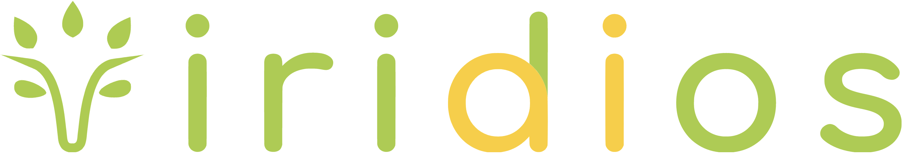
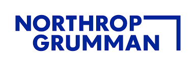

# [Viridios AI](https://www.viridios.ai)
## Data Scientist
### August 2021 - Present
- Designed natural language pipeline to extract
- TODO
- TODO

## Intern, Data Science
### June 2021 - August 2021
- Converted valuation model from fully-connected to convolutional architecture, reducing model size by 85% while maintaining performance
- Implemented simultaneous training of pricing model on market and synthetic datasets, optimizing dual loss functions with disparate weights
- Constructed knowledge graph of carbon offset projects, applied node embedding and link prediction algorithms to estimate contributions to United Nations Sustainable Development Goals (SDGs)

# [Northrop Grumman](https://www.northropgrumman.com)
## Intern, Embedded Systems
### June 2020 - August 2020
- Overhauled radar operational flight program with an Agile team of nine developers
- Implemented an automated regression testing suite, cutting testing time in half
- Revitalized over 50 built-in-test/calibration capabilities of OFP to meet customer’s needs

## Intern, Computer Vision
### June 2019 - August 2019
- Assisted in developing real-time overhead vehicle detection system using YOLOv3
- Automated preprocessing of more than 500k images for deep learning projects
- Explored style-transfer methods on satellite imagery using GANs
